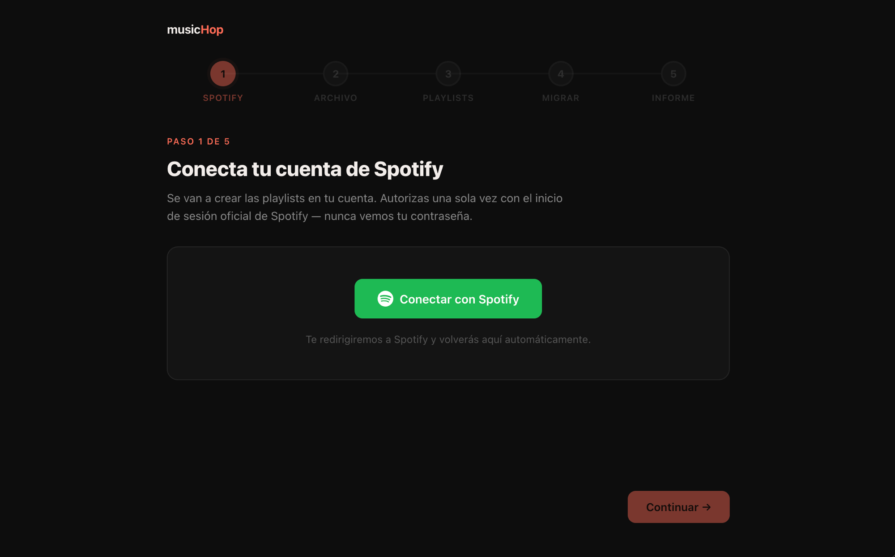
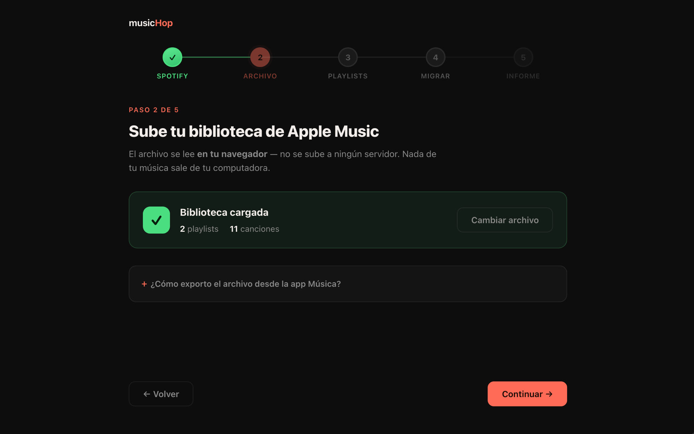
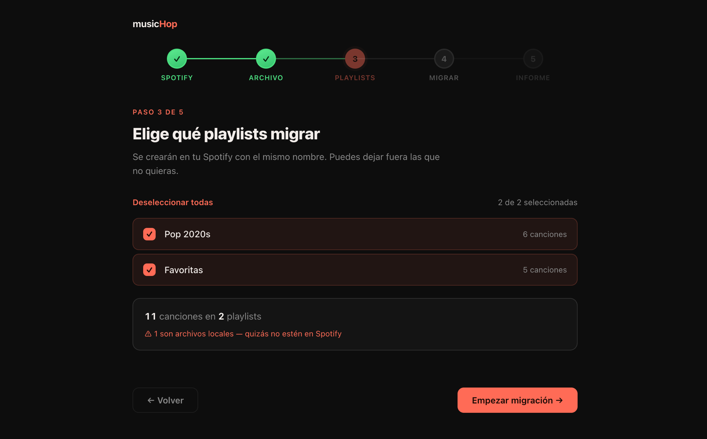

# musicHop

> A tool to move my music from Apple Music to Spotify quickly. It runs entirely in the browser — no backend, nothing uploaded — reads my exported library, and recreates my playlists on Spotify.

<p align="center">
  <br />
  <br />
  
</p>

musicHop is a playlist importer that moves my music from Apple Music
to Spotify. Rebuilding years of playlists by hand wasn't an option, so it's
a small wizard that connects to Spotify, reads the exported library file,
and recreates each playlist track by track.

Matching is strict: it searches by title and artist, breaks ties by album,
and anything without an exact match goes into a report (with a CSV to
download) instead of being replaced by "something close". Nothing leaves
the browser — the library file is parsed locally and the app only talks to
the Spotify API.

**Live demo:** https://music-hop.vercel.app

> **⚠️ Known limitation — Spotify API access.** In November 2024 Spotify restricted catalog endpoints (including search) for development-mode apps. As a personal project, musicHop cannot search Spotify's catalog to match and add tracks.

## What's inside

- **Everything runs client-side.** The exported library XML is parsed in
  the browser with `DOMParser` — no server, nothing uploaded.
- **Spotify sign-in without a backend.** OAuth with PKCE, so there's no
  client secret; tokens live in `localStorage` and refresh automatically.
- **Strict matching, no guessing.** Each track is matched by title +
  artist with album tie-breaking. Unmatched tracks go to a report, never
  replaced with an approximation.
- **A five-step wizard.** Connect Spotify → upload the library → pick
  playlists → migrate → report.
- **Resilient migration.** Requests are throttled to respect Spotify's
  rate limits, tracks are added in batches of 100 in their original order,
  and progress is checkpointed so an interrupted run resumes without
  creating duplicates.
- **A report at the end.** Overall stats, a per-playlist breakdown, and a
  downloadable CSV of everything that couldn't be matched — local files
  flagged separately, since they usually aren't in Spotify's catalog.

## Tech stack

| Layer     | What I use                                                    |
| --------- | ------------------------------------------------------------ |
| Framework | React 18 + Vite                                              |
| Language  | TypeScript (strict)                                          |
| Styling   | Plain CSS with a custom design-token system                 |
| Auth      | Spotify OAuth 2.0 with PKCE — no backend, no client secret  |
| APIs      | Spotify Web API; Apple Music library XML (plist) parsing     |
| Storage   | localStorage — tokens, playlist selection, resumable progress |
| Deploy    | Vercel (production on `main`)                                |

## How matching works

For each track, musicHop searches Spotify by **title + artist**. When
several results come back, the tie is broken by **album**. Without an exact
match, the track is left out — never replaced with an approximation — and
listed in the final report with all its details. Local files (songs that
were personal files rather than store tracks) are flagged separately, since
they usually aren't in Spotify's catalog.

The migration respects Spotify's rate limits (a pause between searches, and
it waits out any `429` using the `Retry-After` header). An interrupted run
can resume from a checkpoint without recreating what already exists.

## Getting started

```bash
git clone https://github.com/valentinalorcap/musichop.git
cd musichop
nvm use            # uses Node 20 from .nvmrc
npm install
cp .env.example .env
# add VITE_SPOTIFY_CLIENT_ID — register an app at developer.spotify.com
npm run dev
```

The app runs on http://127.0.0.1:5173/.

The Spotify client id comes from a registered app. With PKCE it's public
(no secret), and the redirect URI must include `http://127.0.0.1:5173/` for
local use, plus the production URL once deployed. Spotify no longer accepts
`localhost`, so the loopback IP `127.0.0.1` is required locally.

## Deploy

Deployed on Vercel as a static Vite build, detected with no extra config.
The Spotify client id is provided through the `VITE_SPOTIFY_CLIENT_ID`
environment variable, and the production URL is registered as a Spotify
redirect URI.
